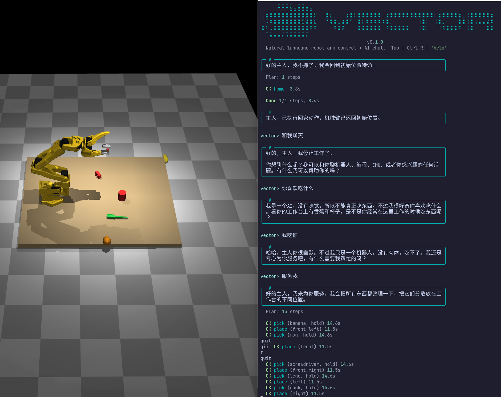
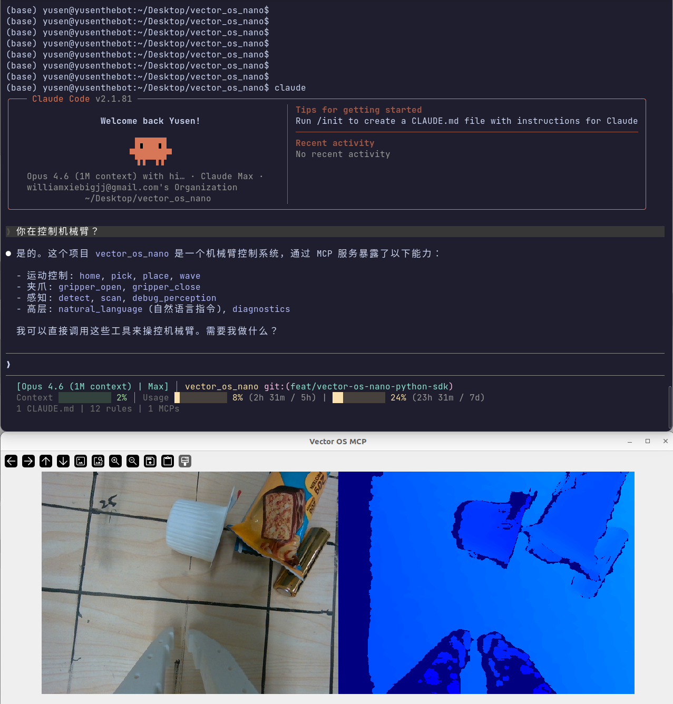
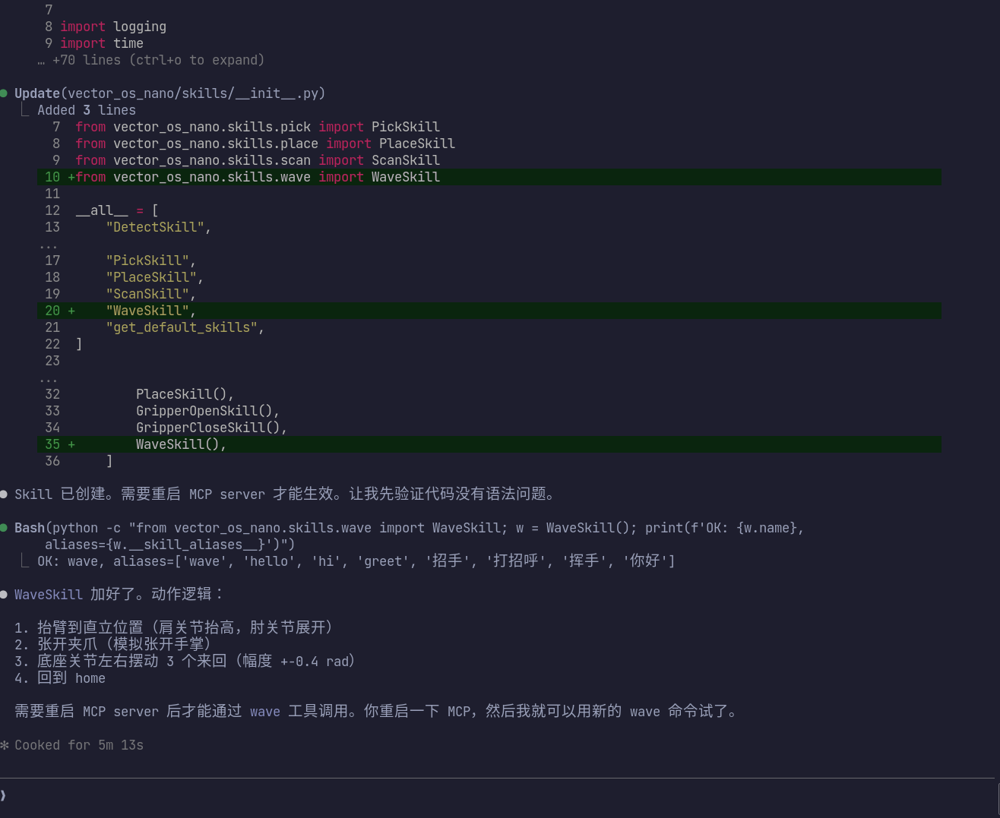

<p align="center">
  
</p>

<h1 align="center">Vector OS Nano</h1>

<p align="center">
  <b>Zero-shot, natural language generalized grasping on a $150 robot arm.</b>
  <br>
  <b>No training. No fine-tuning. Just say what you want.</b>
</p>

<p align="center">
  
  
  
  
  
  
  
  
</p>

<p align="center">
  <i>Vector OS: a cross-embodiment robot operating system with industrial-grade SLAM, navigation, generalized grasping, semantic mapping, long-chain task orchestration and explainable task execution.<br>
  Being developed at <b>CMU Robotics Institute</b>. Nano is the grasping proof-of-value. Full stack coming soon.</i>
</p>

<p align="center">
  <i>Vector OS: 跨本体通用机器人操作系统：工业级SLAM、导航、泛化抓取、语义建图、长链任务编排、可解释任务执行。<br>
  <b>CMU 机器人研究所</b> 全力开发中。Nano 是低成本硬件上的低门槛概念验证，完整系统即将分阶段开源。</i>
</p>

---

<h3 align="center">Demo</h3>

<p align="center">
  <a href="https://drive.google.com/file/d/1a0Y46zHZ9VNUqBVCpGbyP9m2getLlIio/view">
    
  </a>
  <br>
  <i>Click to watch full demo video</i>
</p>

---

## What is Vector OS Nano?

A **Python SDK** that gives any robot arm a natural language brain. `pip install` and go. No ROS2 required.

```python
from vector_os_nano import Agent, SO101

arm = SO101(port="/dev/ttyACM0")
agent = Agent(arm=arm, llm_api_key="sk-...")
agent.execute("pick up the red cup and put it on the left")
```

No hardware? Full simulation:

```python
from vector_os_nano import Agent, MuJoCoArm

arm = MuJoCoArm(gui=True)
arm.connect()
agent = Agent(arm=arm, llm_api_key="sk-...")
agent.execute("把鸭子放到前面")
```

## SkillFlow — Declarative Skill Routing

All command routing is **declarative** via the `@skill` decorator. No hard-coded if/else chains. Skills describe themselves, the system routes automatically.

```python
from vector_os_nano.core.skill import skill, SkillContext
from vector_os_nano.core.types import SkillResult

@skill(
    aliases=["grab", "grasp", "抓", "拿", "抓起"],       # trigger words
    direct=False,                                          # needs planning
    auto_steps=["scan", "detect", "pick"],                 # default chain
)
class PickSkill:
    name = "pick"
    description = "Pick up an object from the workspace"
    parameters = {"object_label": {"type": "string"}}
    preconditions = ["gripper_empty"]
    postconditions = ["gripper_holding_any"]
    effects = {"gripper_state": "holding"}

    def execute(self, params, context):
        # ... pick implementation ...
        return SkillResult(success=True)
```

Routing logic:

```
"home"           → @skill alias match → direct=True → execute (zero LLM)
"close grip"     → @skill alias match → direct=True → execute (zero LLM)
"抓杯子"         → @skill alias match → auto_steps → scan→detect→pick (zero LLM)
"把鸭子放到左边"  → no simple match → LLM plans pick(hold) + place(left) + home
"你好"           → no match → LLM classify → chat response
```

See `docs/skill-protocol.md` for full SkillFlow specification.

## Agent Pipeline

```
User Input
    |
    v
[1. MATCH]     @skill aliases (zero LLM for simple commands)
[2. CLASSIFY]  LLM intent: chat / task / query (only when needed)
[3. PLAN]      LLM decomposes into skill sequence + V speaks
[4. EXECUTE]   Deterministic step-by-step execution
[5. ADAPT]     On failure: explain + suggest alternatives
[6. SUMMARIZE] LLM reports results to user
```

AI assistant **V** speaks before acting, shows live progress, and summarizes after:

```
vector> 把所有东西都随便乱放

╭─ V ──────────────────────────────────────────────────╮
│ 好的主人，我来把所有东西都随便乱放。                     │
╰──────────────────────────────────────────────────────╯
  Plan: 13 steps

  [1/13] pick ... OK 14.6s
  [2/13] place ... OK 11.5s
  ...
  [13/13] home ... OK 3.8s

  Done 13/13 steps, 180.0s

╭─ V ──────────────────────────────────────────────────╮
│ 主人，已把6个物体全部放到不同位置，手臂已回待命。       │
╰──────────────────────────────────────────────────────╯
```

## MuJoCo Simulation

**No robot? No camera? No problem.**

```bash
python run.py --sim              # MuJoCo viewer + interactive CLI
python run.py --sim-headless     # headless (no viewer)
```

- SO-101 arm with real STL meshes (13 parts from CAD)
- 6 graspable objects: banana, mug, bottle, screwdriver, duck, lego
- Weld-constraint grasping, smooth real-time motion
- Pick-and-place with named locations (front, left, right, center, etc.)
- Simulated perception with Chinese/English NL queries

<p align="center">
  
</p>

## Hardware (~$420 total)

| Component | Model | Cost |
|-----------|-------|------|
| Robot Arm | LeRobot SO-ARM100 (6-DOF, 3D-printed) | ~$150 |
| Camera | Intel RealSense D405 | ~$270 |
| GPU | Any NVIDIA with 8+ GB VRAM | (existing) |

<p align="center">
  
</p>

## Quick Start

```bash
# Setup
cd vector_os_nano
python3 -m venv .venv --prompt vector_os_nano
source .venv/bin/activate
pip install -e ".[all]"

# Launch (simulation — no hardware needed)
python run.py --sim

# Launch (real hardware)
python run.py
```

LLM config — create `config/user.yaml`:
```yaml
llm:
  api_key: "your-openrouter-api-key"
  model: "anthropic/claude-haiku-4-5"
  api_base: "https://openrouter.ai/api/v1"
```

## All Launch Modes

```bash
python run.py                  # Real hardware + CLI
python run.py --sim            # MuJoCo sim + viewer + CLI
python run.py --sim-headless   # MuJoCo sim headless
python run.py --dashboard      # Textual TUI dashboard
python run.py --web --sim      # Web dashboard at localhost:8000
```

## Custom Skills

```python
from vector_os_nano.core.skill import skill, SkillContext
from vector_os_nano.core.types import SkillResult

@skill(aliases=["wave", "挥手", "打招呼"], direct=False, auto_steps=["wave"])
class WaveSkill:
    name = "wave"
    description = "Wave the arm as a greeting"
    parameters = {"times": {"type": "integer", "default": 3}}
    preconditions = []
    postconditions = []
    effects = {}

    def execute(self, params, context):
        for _ in range(params.get("times", 3)):
            joints = context.arm.get_joint_positions()
            joints[0] = 0.5
            context.arm.move_joints(joints, duration=0.5)
            joints[0] = -0.5
            context.arm.move_joints(joints, duration=0.5)
        return SkillResult(success=True)

agent.register_skill(WaveSkill())
agent.execute("wave")       # alias match → direct execute
agent.execute("挥手三次")    # alias match → LLM fills params
```

## Project Structure

```
vector_os_nano/
├── core/          SkillFlow protocol, Agent pipeline, Executor, WorldModel
├── llm/           Claude provider (classify, plan, chat, summarize)
├── perception/    RealSense + Moondream VLM + EdgeTAM tracker
├── hardware/
│   ├── so101/     SO-101 arm driver (Feetech serial, Pinocchio IK)
│   └── sim/       MuJoCo simulation (arm, gripper, perception, 6 objects)
├── skills/        Built-in @skill classes (pick, place, home, scan, detect, gripper)
├── cli/           Rich CLI with prompt_toolkit (auto-complete, status bar)
├── web/           FastAPI + WebSocket dashboard
└── ros2/          Optional ROS2 integration (5 nodes)
```

## MCP Server -- Claude Code Controls the Robot

Vector OS Nano exposes all skills via the **Model Context Protocol (MCP)**. Claude Code connects directly and controls the robot -- sim or real hardware -- through natural language.

```bash
# Auto-connects when Claude Code starts (configured in .mcp.json)
# Or manual: python -m vector_os_nano.mcp --sim --stdio
```

**10 MCP tools**: pick, place, home, scan, detect, gripper_open, gripper_close, natural_language, diagnostics, debug_perception
**7 MCP resources**: world://state, world://objects, world://robot, camera://overhead, camera://front, camera://side, camera://live

<p align="center">
  
  <br>
  <i>Claude Code operating the robot arm through MCP -- scan, detect, pick, place via natural conversation.</i>
</p>

### Autonomous Skill Generation

Claude Agent can autonomously design, implement, and test new skills with full reasoning -- then register and execute them immediately.

<p align="center">
  
  <br>
  <i>Claude Agent designing a custom wave skill with full reasoning, code generation, and live execution.</i>
</p>

## What's Coming

The full Vector OS stack under development at **CMU Robotics Institute**:

- **SLAM + Navigation** -- LiDAR/visual SLAM, Nav2, multi-floor mapping
- **Semantic Mapping** -- 3D scene graphs, object permanence, spatial reasoning
- **Multi-Robot Coordination** -- fleet management, task allocation, shared world model
- **Mobile Manipulation** -- wheeled, legged, and humanoid platforms

**Star this repo and stay tuned.**

---

<details>
<summary><b>点击查看中文</b></summary>

## 什么是 Vector OS Nano？

一个 **Python SDK**，让任何机械臂拥有自然语言大脑。`pip install` 即可使用，不需要 ROS2。

```python
from vector_os_nano import Agent, SO101

arm = SO101(port="/dev/ttyACM0")
agent = Agent(arm=arm, llm_api_key="sk-...")
agent.execute("抓起红色杯子放到左边")
```

没有硬件？用 MuJoCo 仿真：

```bash
python run.py --sim
```

## SkillFlow 协议

所有命令路由通过 `@skill` 装饰器声明，零硬编码：

```python
@skill(aliases=["抓", "拿", "抓起"], auto_steps=["scan", "detect", "pick"])
class PickSkill: ...
```

简单命令（home, open, close）零 LLM 调用，常见模式（抓X）自动编排，复杂任务才用 LLM 规划。

## 快速开始

```bash
cd vector_os_nano
python3 -m venv .venv --prompt vector_os_nano
source .venv/bin/activate
pip install -e ".[all]"
python run.py --sim
```

</details>

---

## License

MIT License

---

<p align="center"><i>Built by Vector Robotics at CMU Robotics Institute with Claude Code</i></p>
